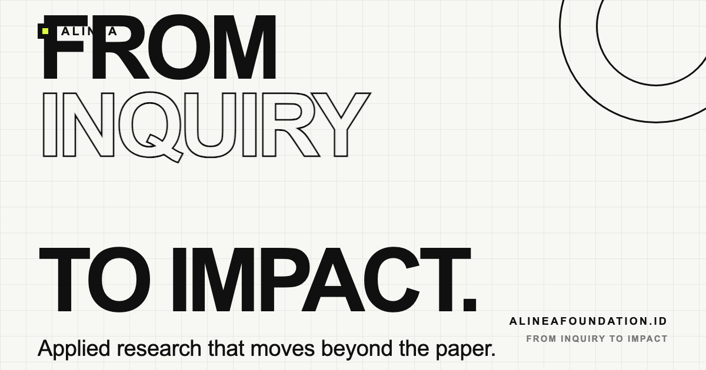

<p align="center">
  
</p>

# ALINEA Research Foundation

> **From Inquiry to Impact.**

Official website for **ALINEA Research Foundation** — an independent applied research foundation based in Indonesia. We explore how research, intelligent technologies, and engineering can be translated into systems that address real-world problems.

> We start with the problem, not the technology.

🌐 Live site: **https://alineafoundation.id**

## About

ALINEA is positioned as a credible research institution — not a startup, not a software house, not a student community. The site uses a **minimalism + restrained brutalism** design language: generous whitespace, strong editorial typography, thin black borders, visible grids, and subtle experimental interactions.

Design, brand, and engineering decisions are documented in [`AGENTS.md`](AGENTS.md).

## Research Direction

- Applied Artificial Intelligence
- Computer Vision
- Artificial Intelligence of Things (AIoT)
- Data-Driven Systems
- AgriTech
- Technology for Real-World Impact

## Tech Stack

- Plain **HTML, CSS, JavaScript** — no frameworks, no build step, no dependencies.
- Sculpted **inline SVG** assets (geometric shapes, pattern tiles, editorial illustrations).
- SEO-ready: semantic HTML, Open Graph / Twitter Card meta, canonical URL, JSON-LD structured data (`ResearchOrganization` + `WebSite`).

## Project Structure

```
├── index.html          # Single-page site (semantic HTML, SEO meta, JSON-LD)
├── AGENTS.md           # Brand / research / design / engineering guidelines
├── CNAME               # Custom domain for GitHub Pages (alineafoundation.id)
├── css/
│   └── styles.css      # Design tokens + layout + brutalist elements
├── js/
│   └── main.js         # Parallax, scroll reveals, mobile nav
└── assets/
    ├── og-image.png        # Social sharing card (1200x630)
    ├── tile-*.svg          # Pattern tiles (dots, hatch, cross, lines)
    └── illustrations/
        ├── hero-study.svg  # Hero editorial illustration
        └── process.svg     # Research process diagram (problem → impact)
```

## Preview Locally

Assets use relative paths (inline sprite + SVG images), so serve the folder over HTTP instead of opening `index.html` from disk:

```sh
python3 -m http.server 8123
# http://localhost:8123
```

## Deployment

Served on **GitHub Pages** from branch `main`, repository root.

- URL: https://alineafoundation.id
- Mirror: https://ade-m.github.io/alinea-web
- DNS: `alineafoundation.id` → 4 GitHub Pages A records (`185.199.108.153`–`185.199.111.153`)

## License

Copyright © 2026 ALINEA Research Foundation.

This repository is public for transparency in how the official site is maintained. Content and designs remain the intellectual property of ALINEA Research Foundation.